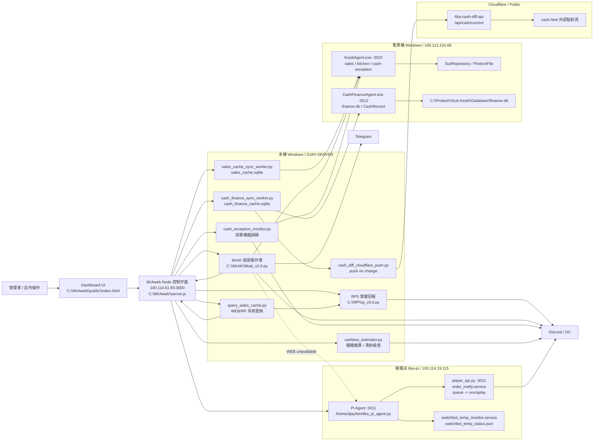

# 6KA 系統日誌與現行架構

更新時間：2026-06-08 08:03 Asia/Taipei

本檔是目前有效的 6KA 系統交接文件：保留現行拓撲、規範、資料語意、檢查路徑與最近仍有效的變更。整理前完整流水已備份到 `backups\開發日誌.archive-20260606-current-topology.md`。

舊交接與歷史修復細節：

- `C:\Users\88698\Documents\6KA系統開發\6KAweb_交接備忘.archive-20260603-before-trim.md`
- `C:\Users\88698\Documents\6KA系統開發\6KAweb_交接備忘.mojibake-backup-20260603-002046.md`
- `C:\Users\88698\Documents\6KA系統開發\backups\開發日誌.archive-20260606-current-topology.md`
- `C:\Users\88698\Documents\6KA系統開發\backups\開發日誌_最新短版.archive-20260606-current-topology.md`

## 先讀這段

- 最高優先任務：每天讀取當天資料並完成必要通知。
- 現場觀測入口：`http://100.114.61.65:3000/`、`/health`、`/api/server/status`、`/api/pi/status`、`/api/logs/:service`。
- 實際 live copy 優先於工作區副本：`C:\6KAweb`、`C:\RP`、`C:\6KAK`、Pi `/home/djay/...`。
- 售票機日常讀取一律走 Tailscale HTTP agent；WinRM 只保留給部署、維護、HTTP agent 修復等必要例外。
- `.env`、webhook、Cloudflare token、售票機密碼、Telegram token 都是機密，不得寫入公開文件或回覆。
- 本機、售票機、樹莓派已授權維護；不要反覆回報「沒有權限」。Pi 優先使用 SSH key `C:\RP\ssh\6ka_pi_codex`，target `djay@6ka-pi`。
- 不要寬泛停止 `python.exe` / `pythonw.exe`；必須依精確 script path、lock/control file、或 `/api/control/...` 操作。
- 一律用 UTF-8 讀寫中文文件。PowerShell 讀檔請用 `Get-Content -Encoding UTF8`。
- Git dubious ownership 是 sandbox 使用者不同，不代表 repo 壞掉。

## 完整拓撲



## Live 路徑與入口

| 類別 | 目前位置 |
|---|---|
| 工作區 | `C:\Users\88698\Documents\6KA系統開發` |
| WEB live | `C:\6KAweb` |
| WEB server | `C:\6KAweb\server.js` |
| Dashboard UI | `C:\6KAweb\public\index.html` |
| Dashboard URL | `http://100.114.61.65:3000/` |
| Health | `http://100.114.61.65:3000/health` |
| Server status | `http://100.114.61.65:3000/api/server/status` |
| Pi status | `http://100.114.61.65:3000/api/pi/status` |
| Live logs | `http://100.114.61.65:3000/api/logs/:service` |
| RP5 | `C:\RP\rp_v5.0.py` |
| 6KAK | `C:\6KAK\6kak_v2.0.py` |
| Sales cache | `C:\6KAweb\data\sales_cache.sqlite` |
| Cash finance cache | `C:\6KAweb\data\finance_cache\cash_finance_cache.sqlite` |
| Finance history snapshot | `C:\6KAweb\data\finance_cache\finance-current.db` |
| Kiosk agent | `http://100.113.224.68:3010` |
| Cash finance agent | `http://100.113.224.68:3012` |
| Pi Agent | `http://100.114.19.115:3011` |
| Player API | Pi `http://127.0.0.1:3021` |
| Cloudflare cash API | `https://6ka-cash-diff-api.jay-fbf.workers.dev/api/cash/current` |

## 本機控制平面

`C:\6KAweb\server.js` 是現行控制平面，負責 Dashboard API、local service start/stop、Pi service control、live log、sales/cash 狀態聚合、worker watchdog 與本機重啟控制。

主要 API：

| API | 用途 |
|---|---|
| `GET /health` | WEB liveness |
| `GET /api/server/status` | 本機服務、售票同步、找零同步、cash monitors 總狀態 |
| `GET /api/pi/status` | Pi Agent / player / temperature / audio 狀態 |
| `GET /api/sales/today?date=YYYY-MM-DD` | 今日營業摘要 |
| `GET /api/temperature/history` | server-side 溫度歷史 |
| `GET /api/logs/:service` | operator live log |
| `POST /api/control/local-service/:service/:action` | 本機服務 start/stop/restart |
| `POST /api/control/pi-service/:service/:action` | Pi player / temperature start/stop |
| `POST /api/control/pi-audio` | 播放測試、音量控制、音效事件轉送 |
| `POST /api/control/reboot/server` | 本機 Windows reboot |
| `POST /api/control/reboot/pi` | Pi reboot |

現行啟動方式：

- WEB 由 `C:\6KAweb\start-6kaweb.bat` / Startup 捷徑啟動。
- RP5、6KAK、CashException、Cashbox estimator 由 WEB hidden 背景管理。
- 可見終端機 launcher 只保留為人工維修備援，不是日常啟動方式。

## 未來改善優先參考

目前評估：

- 現場實用性：約 `8.2/10`。售票機資料、廚房通知、營業回報、找零機、錢箱推算、播放器、溫度監控與 Dashboard 已能支撐日常營運。
- 工程產品化：約 `7.2/10`。扣分主因是 runtime 分散在 Windows / 售票機 / Pi / Cloudflare，設定與密鑰未完全集中，部署、rollback、測試、版本標記仍偏人工。
- 綜合評價：約 `7.6/10`。現階段不是缺功能，而是需要把「能跑」整理成「可重建、可交接、可測試、可預測故障」。

優先級 backlog：

1. `system-manifest` / 一鍵重建基礎
   - 建立一份正式 manifest，列出每個服務的 live path、port、啟動命令、環境變數、health check、log path、heartbeat/control/state path、備份與 rollback 方法。
   - manifest 應覆蓋 `C:\6KAweb`、`C:\RP`、`C:\6KAK`、售票機 Agent、Pi Agent/player/temperature、Cloudflare cash API/public cash page。
   - 目標：換機或重建時，不靠聊天紀錄也能知道每支程式在哪裡、怎麼啟動、怎麼確認健康。

2. 設定與密鑰集中管理
   - webhook、token、Tailscale IP、port、通知門檻、溫度門檻、輪詢間隔都應集中在 `.env` / config。
   - 程式碼內不得新增硬編碼密鑰；現有硬編碼密鑰應逐步搬出。
   - 目標：換 webhook、換 IP、換 port 或調整門檻時，不需要修改 source code。

3. 一鍵健康檢查與故障分級
   - 建立 `health-check` 腳本或 WEB endpoint，輸出三件事：現在能不能營業、哪個環節壞了、下一步要做什麼。
   - 覆蓋 WEB、RP5、6KAK、sales sync、cash sync、KioskAgent、CashFinanceAgent、Pi Agent、player、temperature、Cloudflare cash public GET。
   - 告警分級應區分 info / warning / operational outage / cash-risk；服務活著與業務異常要分開。

4. 測試 fixture / dry-run 模擬
   - 建立可離線跑的測試資料：售票機離線、Kitchen 新單、找零機錯誤碼、清鈔相符、清鈔不符、人工現金操作、Pi 音效不可用、溫度結露風險。
   - 每個核心流程至少有一個 parser / formatter / decision-rule 測試。
   - 目標：改通知、改金額語意、改 log 節流時，不必只靠 live 觀察。

5. 服務邊界與控制平面整理
   - WEB 是控制平面，但要避免責任繼續膨脹；資料同步、通知、控制、前端、稽核的 API/狀態/責任要寫清楚。
   - 新功能優先放在對應 worker / agent，WEB 做聚合與控制，不把所有業務邏輯塞進 `server.js`。
   - 目標：未來出錯時能快速判斷是資料源、同步、通知、播放、UI 或控制問題。

6. 資料語意正式規格化
   - 將 `SettlementDetail + CashRecord`、`target=1 flow_mode=4`、`target=0 flow_mode=3/4`、`net_sales_amount/net_amount` 等語意整理成正式 spec。
   - 每個金額欄位要標明來源、用途、可否當作現場餘額、不可誤解點。
   - 目標：任何人接手都不會再把結算狀態誤解成 live cashbox balance。

7. Dashboard 診斷升級
   - 目前 Dashboard 可看 active/log；下一步是直接回答「能不能營業、哪個環節壞、下一步做什麼」。
   - 可新增 operator summary：銷售資料、廚房通知、現金同步、找零機、播放、溫度，各自用一句話說明健康與建議動作。
   - 目標：手機上不需要看 raw JSON 也能判斷下一步。

8. 版本、部署、驗證、回滾制度化
   - 每次 live change 都要記錄版本/備份名/部署時間/驗證結果/回滾方式。
   - 建議每個 runtime 檔案有可查版本或 `--version` / health version。
   - 目標：出問題時能在 1 分鐘內知道現在跑的是哪一版，5 分鐘內能回滾。

滿分定義：

- `9.x`：有 manifest、集中設定、一鍵健康檢查、主要流程 fixture、清楚告警分級與回滾路徑。
- `10/10`：換一台新主機時，照 manifest 與腳本可在約 30 分鐘內重建整套 6KA，而且不需要原作者口頭補充。

## Local Services

| Service | Live 程式 | 主要資料/狀態 | 管理方式 |
|---|---|---|---|
| `rp5` | `C:\RP\rp_v5.0.py` | `C:\RP_log\rp5_console.log`、`rp5_heartbeat.json` | WEB local-service API |
| `kitchen_dc` | `C:\6KAK\6kak_v2.0.py` | `C:\6KA_log\6kak_runtime.log`、`6kak_heartbeat.json` | WEB local-service API |
| `cash_exception` | `C:\6KAweb\cash_exception_monitor.py` | `cash_exception_monitor_heartbeat.json`、control/state JSON | WEB watchdog + local-service API |
| `cashbox_estimator` | `C:\6KAweb\cashbox_estimator.py` | `cashbox_estimator_heartbeat.json`、latest estimate JSON | WEB watchdog + local-service API |
| `sales_sync` | `C:\6KAweb\sales_cache_sync_worker.py` | `sales_cache.sqlite`、sales sync state | WEB watchdog / deploy script |
| `cash_finance_sync` | `C:\6KAweb\cash_finance_sync_worker.py` | `cash_finance_cache.sqlite`、`sync_state.json`、sync log | hidden worker |

Dashboard 服務標籤只表示服務是否在跑；業務異常用色彩、tooltip、明細區呈現，不把 `active` 改成告警文字。

## 銷售鏈路

資料流：

```text
售票機 SuitRepository / ProtechFile
  -> KioskAgent :3010 /api/sales/incremental
  -> C:\6KAweb\sales_cache_sync_worker.py
  -> C:\6KAweb\data\sales_cache.sqlite
  -> query_sales_cache.py
  -> Dashboard / RP5
```

規範：

- `sales_cache.sqlite` + sync state 是本機 sales source-of-truth。
- RP5 讀本機 cache，不代表每次查詢都直接連上售票機。
- RP5 連線/斷線通知必須依 `sync_state`、`last_success_at`、`last_error_at`、freshness/staleness 判斷。
- 營業額使用淨收：優先 `net_sales_amount` / `net_amount`，必要時用 `amount - change_amount` fallback。
- 售票機非營業時間關機或 timeout 時，先判斷是 expected offline 還是同步 worker 真壞掉。

## 6KAK / 廚房通知 / 播放

資料與通知流：

```text
KioskAgent /api/kitchen-log?date=YYYY-MM-DD
  -> C:\6KAK\6kak_v2.0.py
  -> Discord / Telegram
  -> WEB /api/control/pi-audio
  -> Pi Agent /api/audio/test
  -> player_api.py queue
  -> sox/aplay
```

規範：

- 6KAK 是廚房製作單事件來源與最後保底通知線。
- Primary 只走 Tailscale HTTP `KioskAgent /api/kitchen-log`。
- HTTP agent 不可用時 fallback 到 `\\100.113.224.68\ProtechFile\YYYY-MM-DD\DeviceLog\Kitchen`；不要恢復舊 hostname UNC。
- 6KAK 有 singleton lock，第二份會直接退出，避免重複通知。
- 播放日常 primary 是 WEB；WEB 不通時 6KAK 可直接打 Pi Agent。
- 不要把 Cloudflare audio queue 當現行拓撲；若代碼仍有 legacy fallback，維運時仍先查 WEB / Pi Agent / player_api。

## 找零同步與公開點鈔

資料流：

```text
售票機 finance.db / CashRecord
  -> CashFinanceAgent :3012 /api/finance/incremental
  -> C:\6KAweb\cash_finance_sync_worker.py
  -> cash_finance_cache.sqlite + sync_state.json
  -> cash_diff_cloudflare_push.py
  -> Cloudflare Worker KV
  -> public GET /api/cash/current
  -> cash.html
```

規範：

- `cash_finance_cache.sqlite` 是近期/current stream；歷史月稽核要合併 `SettlementDetail + CashRecord`。
- Cloudflare cash push 是 change-based。第一輪或 hash 改變時 `cloud=yes`；金額未變時 `cloud=no` 是正常。
- Cloudflare public GET 只公開點鈔必要摘要，不公開 token。
- 若 `/api/server/status` 顯示 `cash_finance.ok=false` 但 `source_latest_time == local_latest_time` 且 `freshness_lag_seconds=0`，先當作售票機/agent reachability timeout，查 `cash-finance-sync.log` 和 `sync_state.json`，不要直接改 worker。
- `target=1` + `flow_mode=4` 是結算/清鈔狀態，不是現場錢箱即時餘額。

## CashException 找零機錯誤碼

資料流：

```text
KioskAgent /api/cash-exception?date=YYYY-MM-DD
  -> C:\6KAweb\cash_exception_monitor.py
  -> Dashboard status / today incidents
  -> Discord
  -> Pi audio warning/error
```

規範：

- 只支援 `--source agent`；不再使用 WinRM/shared-path fallback 作為日常讀取。
- 營業時間：`10:30-21:30`；非營業時間不 poll 售票機。
- 通知格式單行：`# 找零機：<精簡錯誤>`。
- 每筆新的 CashException 事件通知一次，以 `timestamp|code|message` 去重。
- warning 音效預設 `wrong.wav`，critical 預設 `error.wav`；保留 `ding.wav`、`beep.wav` 類型。

## Cashbox Estimator / 月現金稽核

Cashbox estimator：

- Live：`C:\6KAweb\cashbox_estimator.py`
- 維持獨立程式，不併入 `cash_finance_sync_worker.py`。
- 用 POS sales + cash DB 做閉環推論。
- `錢箱推算 = 前次清鈔後現金淨收 - 前次清鈔後交易找零槽淨變化`。
- 人工補幣/退幣 (`target=0, flow_mode=3/4`) 單獨列，不納入清鈔應清金額。
- 新清鈔不符才通知，同一清鈔 event id 去重；服務首次啟動只做 baseline，不追補舊事件。
- 新人工現金操作：`清鈔`、`補幣`、`退幣`、`補鈔`、`退鈔` 會通知；一般交易 flow 不通知。

月稽核：

- 工具：`C:\6KAweb\cash_month_audit.py`
- 永遠合併 `SettlementDetail + cash_records`，用事件 `Id` 去重。
- 不要把沒有 `cash_records` 的歷史月份誤判成機器金額 0。
- POS vs 機器對得上，只代表機器流水能解釋 POS 現金；是否實際短少仍要跟現場盤點/收到金額比對。

## Pi / 播放 / 溫度

Pi 入口：

- Host：`6ka-pi` / `100.114.19.115`
- SSH：`djay@6ka-pi`
- SSH key：`C:\RP\ssh\6ka_pi_codex`
- Pi Agent：`/home/djay/bin/6ka_pi_agent.py`，HTTP `:3011`
- Player：`/home/djay/player/player_api.py`，local API `127.0.0.1:3021`
- Temperature：`/home/djay/projects/order_notify/switchbot_temp_monitor.py`

Player 規範：

- `player_api.py` 負責 queue、priority、`sox -> aplay`。
- `/health` 不寫 live log。
- 整點音效設備不可用只寫第一次，避免洗頻。
- 音效設備真正播放失敗由 player_api 發 DC 告警；WEB 只做轉送與 preflight 記錄。

溫度通知現況：

- 版本：`2026.06.06-fuzzy-comfort`
- 舒適區：`23.0-26.0°C`
- 邊緣容忍：`22.5-23.0°C` / `26.0-26.5°C` 先觀察 10 分鐘；EMA 繼續往外惡化至少 `0.2°C` 才切 `COLD/HOT`。
- `>=26.5°C` 或 `<=22.5°C` 仍立即切 `HOT/COLD`。
- 結露風險只在 `business_hours=true`、濕度 >= `70%`、露點達門檻時成立；非營業時間冷氣關閉，不切 `CONDENSATION_RISK`。
- 單顆用餐區感測器暫時掃不到只進 heartbeat；兩顆都離線才通知。

## Dashboard 與 UI/Log 規範

- Dashboard 是操作入口，不是行銷頁；保持緊湊、可掃描、可重複操作。
- 系統狀態服務標籤只顯示小寫 `active` / `stopped`。
- 播放器不顯示 queue 後綴，溫度計不顯示 heartbeat 秒數後綴。
- 找零機故障、清鈔不符、音效不可用等業務告警用紅色與 tooltip/明細區表示。
- `/api/logs/:service` 使用白名單，不接受任意檔案路徑。
- Live log operator view 保留：啟動、停止、資料來源切換、online/offline/recovered、通知送出、訂單處理、現金操作、清鈔不符、播放接收/失敗、溫度 connection/comfort 狀態變化。
- Live log 省略：固定 interval 輪詢、HTTP health check、同一錯誤持續 retry、同一 waiting folder、同一狀態週期摘要、舊日期 noise。

## 通知規範

- RP5：每天自動送營業回報；不要反覆向使用者確認正常營業通知。
- RP5 啟動時不送「已成功連線售票機」；只有真同步中斷達門檻才送斷線通知，恢復後才送恢復。
- 6KAK：新製作單、真離線/恢復事件通知；第一次看到售票機連線只寫 log。
- CashException：每筆新錯誤碼通知一次，不用 warning 首次/第三次門檻。
- Cashbox：新清鈔不符、人工現金操作才通知；不追補服務啟動前舊事件。
- Player：音效設備不可用由 player_api 發單行 DC，並有 cooldown。
- Temperature：只送必要異常/恢復；無 emoji、無品牌前綴、無電量/更新時間細節。

## 資料語意

- Dashboard / RP / DC 營業額一律以淨收為準。
- `net_sales_amount` / `net_amount` 優先；缺值時才用 `amount - change_amount`。
- `sales_cache.sqlite` 是 WEB/RP 的本機銷售快取。
- `cash_finance_cache.sqlite` 是近期/current cash stream。
- `finance-current.db` / `SettlementDetail` 補歷史現金流水。
- `SettlementDetail + CashRecord` 是月現金稽核的完整資料源。
- `target=1 flow_mode=4` 是 settlement / cash-clear 狀態，不是 live cashbox balance。

## 部署規範

- 改 live 前先備份 live 檔，備份名稱要含日期與目的。
- Python：本地 `python -m py_compile`，遠端 Pi 用 `python3 -m py_compile`。
- Node：`node --check C:\6KAweb\server.js`。
- Pi 檔：先 scp 到 `/tmp`，遠端 compile 通過後覆蓋，再用 WEB/Pi control API stop/start；不要直接卡在互動式 sudo。
- Windows 背景服務：用 `/api/control/local-service/:service/:action` 或精確 script process；不要殺所有 Python。
- 部署後驗證至少要有 API status、heartbeat 或 log 證據。

## 快速檢查

```powershell
Invoke-RestMethod -Uri http://100.114.61.65:3000/health -TimeoutSec 5
Invoke-RestMethod -Uri http://100.114.61.65:3000/api/server/status -TimeoutSec 8
Invoke-RestMethod -Uri http://100.114.61.65:3000/api/pi/status -TimeoutSec 8
Invoke-RestMethod -Uri http://100.114.61.65:3000/api/logs/rp5?lines=30 -TimeoutSec 8
Invoke-RestMethod -Uri http://100.114.61.65:3000/api/logs/kitchen_dc?lines=30 -TimeoutSec 8
Invoke-RestMethod -Uri http://100.114.61.65:3000/api/logs/cash_exception?lines=30 -TimeoutSec 8
Invoke-RestMethod -Uri http://100.114.61.65:3000/api/logs/cashbox_estimator?lines=30 -TimeoutSec 8
Invoke-RestMethod -Uri http://100.114.61.65:3000/api/logs/player?lines=30 -TimeoutSec 8
Invoke-RestMethod -Uri http://100.114.61.65:3000/api/logs/temperature?lines=30 -TimeoutSec 8
C:\Python312\python.exe C:\6KAweb\query_sales_cache.py --status
Get-Content -LiteralPath C:\6KAweb\data\finance_cache\sync_state.json -Encoding UTF8
Get-Content -LiteralPath C:\6KAweb\logs\cash-finance-sync.log -Tail 30 -Encoding UTF8
```

## 故障判斷路徑

Dashboard 打不開：

1. 查 `http://100.114.61.65:3000/health`。
2. 查 Node process 與 `C:\6KAweb\server.js`。
3. 查 Windows startup / `start-6kaweb.bat`。
4. 若剛 reboot，等 Startup 與 watchdog 完成後再判斷。

營業額未更新：

1. 查 `/api/server/status` 的 sales freshness。
2. 查 `C:\6KAweb\query_sales_cache.py --status`。
3. 查 `sales_cache_sync_worker.py` heartbeat / log。
4. 查 `KioskAgent /api/status` 與 `/api/sales/incremental`。
5. 若非營業時間售票機關機，先視為 expected offline。

6KAK 沒通知：

1. 查 `/api/logs/kitchen_dc`。
2. 查 `KioskAgent /api/kitchen-log?date=YYYY-MM-DD`。
3. 查 fallback UNC 是否只用 `\\100.113.224.68\ProtechFile`。
4. 查 6KAK singleton / processed cache。
5. 查 WEB/Pi audio，但不要把播放問題當成廚房通知本身失敗。

找零同步未更新：

1. 查 `C:\6KAweb\logs\cash-finance-sync.log`。
2. 查 `C:\6KAweb\data\finance_cache\sync_state.json`。
3. 查 `cloudflare_push_state.json`。
4. 查 public `GET /api/cash/current`。
5. 若 source/local latest id 相同且 lag=0，只是 agent timeout 時，先查 kiosk 是否關機/不可達。

Pi 播放不能播：

1. 查 `/api/pi/status` 的 `services.player`、`player.queue_size`、`audio.available`。
2. 查 `/api/logs/player`。
3. 查 player local API `127.0.0.1:3021`。
4. 查音效卡 `LABTLM40XP` 是否存在。
5. player_api 才是聲音裝置告警來源。

溫度通知異常：

1. 查 `/api/pi/status` 的 `temperature.version`、`comfort`、`business_hours`、heartbeat age。
2. 查 `/api/logs/temperature`。
3. 舒適區邊緣先看是否仍在 10 分鐘觀察期。
4. 非營業時間不應進 `CONDENSATION_RISK`。

## 目前 live 快照

2026-06-06 02:46 左右驗證：

- `/health` OK，service `6KA message center`，host `100.114.61.65:3000`。
- `/api/server/status`：RP5、6KAK、CashException、Cashbox estimator 均 active；sales lag `0`。
- Cash finance 當下 `ok=false`，last_error 是 timeout，但 source/local latest id 都是 `487517`、freshness lag `0`。此類狀態先按售票機/agent reachability 判斷。
- `/api/pi/status`：source `pi_agent`，player active PID `975751`，temperature active PID `979826`，temperature version `2026.06.06-fuzzy-comfort`。
- Pi audio 當下 `available=false`，錯誤 `Invalid card number 'LABTLM40XP'`；播放問題應查 Pi/player，不先改 6KAK。

Live PIDs 是易變資訊，不得當成文件真理；下次操作前重新查 API。

## 最近有效變更

- 2026-06-08：WEB「本月累計」異常調查與 sales/cash cache 防呆已部署。`C:\6KAweb\data\sales_cache.sqlite` 的 `PRAGMA integrity_check` 回報 index corruption；同時 `sync_state` 紀錄 source/local latest 都是 `2026-06-07 19:52:19`、orders `97043`，但實際資料表只到 `2026-06-02 14:46:28`、orders `96782`，所以舊健康判斷會誤以為同步，月統計實際只算到 6/2。已更新 live `C:\6KAweb\sales_cache_sync_worker.py`：單實例 lock 避免雙 worker 同寫、SQLite `busy_timeout=30000`、週期 `PRAGMA integrity_check(50)`、`sync_state` row/latest 與實表 row/latest 比對；若發現 mismatch 且售票機 agent 離線，不清空 DB，只寫入 `cache rebuild pending`，等 `KioskAgent :3010` 可連且 incremental/full fetch 成功後，才把舊 `sales_cache.sqlite`、WAL、SHM 備份到 `C:\6KAweb\data\corrupt_backups` 並自動重建。`C:\6KAweb\cash_finance_sync_worker.py` 同步加上 lock、`busy_timeout`、recent overlap refetch、integrity/state 檢查與 snapshot rebuild，避免 cash cache 發生類似「狀態看似正常、實表不一致」。WEB `server.js` 改用 `Asia/Taipei` business date，`/api/server/status` 新增 `cache_mismatch`、`sync_local_latest_time`、`actual_local_latest_time`、`latest_sync_error_*`、`latest_correction_*`；Dashboard `index.html` 在售票機欄位新增「同步出錯 / 自動糾錯」。部署後 live `server.js` Node PID `10228`、sales worker PID `29820`；`/api/server/status` 正確顯示 `kiosk.sales.cache_mismatch=true`、source latest `2026-06-07 19:52:19`、actual local latest `2026-06-02 14:46:28`、`latest_sync_error_message=cache rebuild pending...`。目前售票機/KioskAgent 仍 timeout，`本月累計` 要等 agent 恢復後完成自動重建才會回到正確數字。
- 2026-06-08：新增售票機即時畫面監控鏈。售票機新增 `KioskMonitorAgent.cs`，live path `C:\6KA\kiosk-monitor-agent`，排程 `6KA Kiosk Monitor Agent` 以 `wscript.exe "C:\6KA\kiosk-monitor-agent\start-hidden.vbs"` 背景啟動，HTTP `:9581`；觀察端點包含 `/api/status`、`/api/screenshot?max_width=720`、`/api/processes`、`/api/windows`、`/api/desktop`、`/api/logs?name=...`，不提供遠端命令。六花鍵鼠 `TicketPadController.cs` 版號到 `0.2.7` 並補備援 `GET /api/screenshot`。WEB `C:\6KAweb\server.js` 新增 `/api/kiosk/screenshot/status`、`/api/kiosk/screenshot/refresh`、`/api/kiosk/screenshot/latest`，來源 `http://100.113.224.68:9581/api/screenshot?max_width=720`，timeout 4 秒；只保留 `C:\6KAweb\data\kiosk_monitor\latest-screenshot.png` 與 `latest-screenshot.json`。Dashboard「即時畫面」欄位右側改為純文字最後成功截圖時間；點開 overlay 才每秒刷新，關閉 `X`、點背景或 Escape 會清 timer 並 abort in-flight request。離線或售票機關閉時保留最後一張截圖，顯示 `售票機離線 · 最後截圖 HH:MM:SS · 5秒後重試`；若完全無快取才顯示 placeholder。已驗證 latest 端點在離線時仍回 200、bytes `277739`；abort 測試約 `520ms` 得 `AbortError`。
- 2026-06-08：售票機 Ticket Pad Controller / 六花鍵鼠已整理成獨立維運日誌 `ticket_pad_controller_log.md`。本機程式碼在 `TicketPadController.cs`；前端來源/發佈在 `outputs\ticket-pad-ui-20260607-220947\static\app.js`、`outputs\ticket-pad-controller-release\publish`、`outputs\ticket-pad-controller-release\payload`；部署腳本是 `deploy_ticket_pad_controller.ps1`。live 版本 `0.2.3`，售票機路徑 `C:\6KA\ticket-pad-controller`，執行檔 `C:\6KA\ticket-pad-controller\TicketPadController.exe`，排程 `6KA Ticket Pad Controller` 以 `wscript.exe "C:\6KA\ticket-pad-controller\start-hidden.vbs"` 隱藏啟動；Tailscale URL `http://100.113.224.68:9580/`，LAN URL 目前 `http://192.168.50.65:9580/`，售票機 LAN MAC `00-90-05-0F-9C-F7`。WebSocket `/ws` 已啟用；ACT 僅保留 `重啟售票程式`、`關閉售票程式`、`重新啟動`、`關機`。已移除 `回到後台/進入後台`、游標開關、游標置中；modifier HUD 延遲由 `430ms` 改為 `80ms`；新增左手區滑鼠左鍵取消工具列選取、橫式右側框外取消工具列選取。網站標題/圖示已改為「六花鍵鼠」與 `/static/6ka-mouse-icon.png`。今日已清除一次性測試排程、截圖與已停用輸入紀錄器殘留，清理後 `C:\6KA\ticket-pad-controller` 約 `14.23 MB`；正式 `TicketPadController.exe`、`KioskAgent.exe`、`CashFinanceAgent.exe` 均仍在跑。已驗證 `/api/state` 回 `ok=true`、version `0.2.3`，線上 `app.js` 含 `SHORTCUT_HUD_DELAY_MS = 80`、`cancelActiveMode`、`isRightOutsideController`。
- 2026-06-08：六花鍵鼠 live 升到 `0.2.5`，修正 WebSocket request id 覆蓋 ACT macro id 的問題。先前點 `動作/關機` 時 live log 顯示 `event ok type=run_macro id=2081 message=macro not implemented: 2081`，根因是 `app.js` 用 `{ ...payload, id }` 包 WebSocket 訊息，蓋掉 `shutdown_machine`。前端已改用 `request_id`，後端 `AddPayloadId()` 優先回 `request_id` 作為 ack id，macro `id` 保留給 `RunMacro()`；`index.html` app.js query 升為 `20260608-macro-ws-id-fix` 避免瀏覽器拿舊檔。部署後 `/api/state` 回 `version=0.2.5`，live JS 含 `request_id: id` 且不含舊覆蓋式；無害 WebSocket probe `probe_macro_after_deploy/request_id=5151` 回 `macro not implemented: probe_macro_after_deploy` 且 ack `id=5151`。未實際觸發 `shutdown_machine`；售票機桌面 `關機.lnk`、`重新啟動.lnk` 已確認存在。
- 2026-06-07：WEB 營業回報 live log 修正。`server.js` 的 `logDisplayGroup('rp5')` 原本把全部 `狀態 ok date=... orders=... bowls=... revenue=...` 歸為單一 `rp5-ok`，所以 Dashboard/RP5 live log 只剩最新狀態，不像營業回報流水；已改成依 `date/orders/bowls/revenue` 建立分組，並在 `cleanServiceLogContent()` 對此類分組保留第一次出現，讓時間對應實際營業數字變化，同數值的 5 分鐘輪詢仍被摺疊。已部署到 live `C:\6KAweb\server.js`，備份 `C:\6KAweb\backup-rp5-log-first-change-20260607-201956`；`node --check` 通過，WEB Node PID `13720`，`/api/logs/rp5?lines=120` 驗證顯示 36 行，最後一筆為 `19:52:30 orders=31 bowls=50 revenue=$11760 latest=19:52:19`。
- 2026-06-07：售票機輸入紀錄器已部署。新增 `KioskInputRecorder.cs`、`deploy_kiosk_input_recorder.ps1`、`verify_kiosk_input_recorder.ps1`；遠端安裝在 `C:\6KA\input-recorder\KioskInputRecorder.exe`，排程 `6KA Kiosk Input Recorder` 以互動登入隱藏啟動。每日只保留當天 `logs\input-YYYY-MM-DD.jsonl` 與 `screenshots\YYYY-MM-DD\click-*.png`；點擊事件記錄座標、active window、UI Automation element 與含紅色座標標記的截圖。使用者確認為私人機器，部署設定 `INPUT_RECORDER_LOG_TEXT_KEYS=1`，完整記錄按鍵；2026-06-07 18:00 驗證 live PID `9812`、state ok、截圖正常。
- 2026-06-06：售票機桌面重啟捷徑控制鏈已部署。KioskAgent v0.1.5 新增 `POST /api/control/restart-shortcut`，WEB 新增 `POST /api/control/reboot/kiosk` 與 Dashboard 售票機重啟按鈕；KioskAgent 控制端預設只允許 `100.114.61.65`、loopback 呼叫，可用 `KIOSK_RESTART_SHORTCUT_PATH` 指定精確 `.lnk`。WEB 備份 `C:\6KAweb\backup-kiosk-restart-button-20260606-200619`；KioskAgent live `0.1.5` PID `6132`；已由使用者實測可正常執行。
- 2026-06-06：RP5 / WEB 營業回報 live log 已過濾 `通知內容已寫入: C:\RP_log\YYYY-MM-DD.txt` 寫檔流水；`/api/logs/rp5?lines=80` 驗證剩 6 行事件，保留啟動、recovered、sync_error、kiosk_offline 通知與最新 ok 狀態。WEB live PID `77520`；備份 `C:\6KAweb\backup-rp5-log-filter-20260606-204616`。
- 2026-06-06：整理日誌，主文件改為現行拓撲/規範，不再把已取代的事件流水放在主敘述。
- 2026-06-06：六支程式 live log 改成 operator view，Dashboard 服務標籤可直接開即時 log。
- 2026-06-06：Pi temperature 升到 `2026.06.06-fuzzy-comfort`，加入舒適區邊緣觀察與非營業時間不結露規則。
- 2026-06-05：RP5 / 6KAK 改由 WEB hidden 背景管理，可見終端機只保留為人工維修備援。
- 2026-06-05：售票機日常資料改走 Tailscale HTTP agent；WinRM 不再是日常讀取路徑。
- 2026-06-05：CashException 與 Cashbox estimator 由 WEB 背景管理，Dashboard 提供狀態與啟停。

## 已取代資訊

- 2026-06-04 的 RP5/6KAK 可見終端機日常要求已取代；現行以 WEB hidden 背景管理與 Dashboard live log 為準。
- 舊 hostname UNC fallback 不再使用；只允許 Tailscale UNC `\\100.113.224.68\ProtechFile` 作 6KAK fallback。
- WinRM 不再是日常資料讀取路徑。
- Cloudflare audio queue 不列入現行播放拓撲；現行維運以 WEB / Pi Agent / player_api 為準。
- 溫度舊 `HIGH_HUMID` / 單純濕度告警已取代；目前只看必要異常、舒適區規則、營業時間內結露風險。
- 固定 PID、舊驗證快照、舊備份流水不放在主文件；需要追溯請看 `backups` archive。
