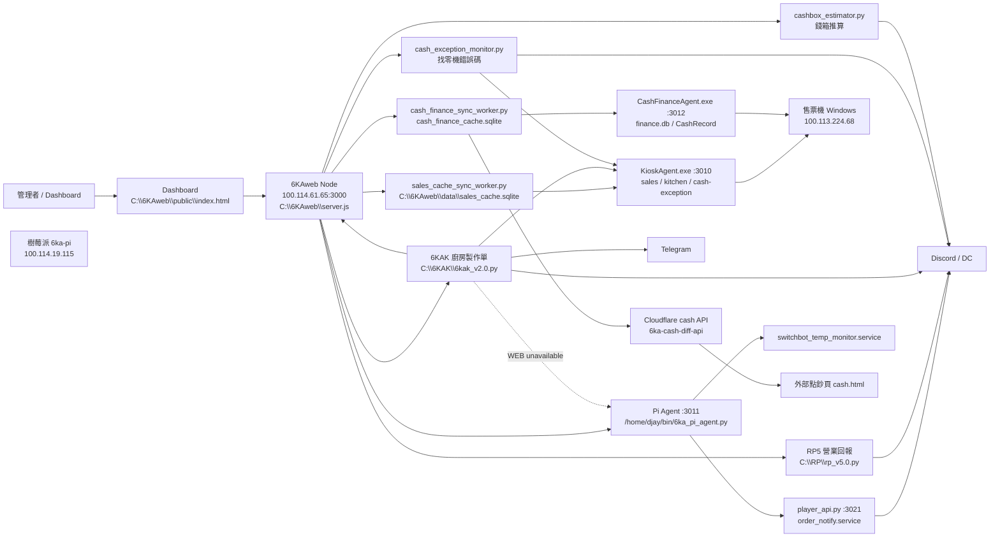

# 6KA 最新短版開發日誌

更新時間: 2026-06-08 08:03 Asia/Taipei

本檔是 6KA 系統交接入口，只保留現在有效的架構、規範、拓撲與檢查路徑。整理前版本已備份到 `backups\開發日誌_最新短版.archive-20260606-current-topology.md`。完整現行規格與各模組細節看 `開發日誌.md`。

## 最高原則

- 每天讀取當天資料並通知是本系統最高優先任務。
- 現場觀測先看 Dashboard / API：`/health`、`/api/server/status`、`/api/pi/status`、`/api/logs/:service`。
- 日常讀狀態、讀 log、查銷售、同步資料一律走 Tailscale HTTP agent；WinRM 只保留給部署、維護、HTTP agent 修復。
- 實際 live copy 優先於工作區副本：`C:\6KAweb`、`C:\RP`、`C:\6KAK`、Pi `/home/djay/...`。
- `.env`、webhook、Cloudflare token、售票機密碼不得寫入公開文件或回覆。
- 不要用寬泛方式停止 `python.exe` / `pythonw.exe`；必須依精確 script path 或服務控制 API 操作。
- PowerShell 讀寫中文文件一律 UTF-8：`Get-Content -Encoding UTF8`。
- Git dubious ownership 是 sandbox 使用者不同，不代表 repo 壞掉。

## 現行拓撲



## 現行鏈路

- WEB / Dashboard：`C:\6KAweb\server.js` 是控制平面與 watchdog；前端是 `C:\6KAweb\public\index.html`。
- RP5：讀本機 `sales_cache.sqlite`，不直接連售票機；連線通知要看 sales sync health，不用「快取可讀」當作售票機 connected。
- 6KAK：primary 讀 `KioskAgent /api/kitchen-log`；只在 HTTP agent 不可用時 fallback 到 `\\100.113.224.68\ProtechFile\...\DeviceLog\Kitchen`。
- 播放：日常鏈路是 `6KAK -> WEB /api/control/pi-audio -> Pi Agent -> player_api.py -> queue -> sox/aplay`；WEB 不通時 6KAK 可直接打 Pi Agent。不要把 Cloudflare audio 當現行播放拓撲。
- Sales sync：`KioskAgent :3010 -> sales_cache_sync_worker.py -> sales_cache.sqlite -> query_sales_cache.py -> WEB/RP5`。
- Cash sync：`CashFinanceAgent :3012 -> cash_finance_sync_worker.py -> cash_finance_cache.sqlite -> cash_diff_cloudflare_push.py -> Cloudflare cash API -> cash.html`。
- CashException：營業時間內透過 `KioskAgent /api/cash-exception?date=YYYY-MM-DD` 讀錯誤碼；非營業時間不 poll 售票機。
- Cashbox estimator：獨立推估，不併入 cash sync worker；使用 sales + cash DB 做 POS/cash 閉環推論。
- Pi status：以 Pi Agent 為主；`player_api.py` 管播放 queue，`switchbot_temp_monitor.py` 管溫濕度 heartbeat 與通知。

## 基本規範

- 服務狀態文字：service-like 用 `active/stopped`；connection/device-like 用 `online/offline` 或 `available/unavailable`。
- 服務活著不代表業務正常；找零機故障、清鈔不符、音效不可用等業務告警用紅色狀態與 tooltip，不改服務標籤文字。
- Dashboard live log 只保留人需要看的事件：啟動、停止、資料來源切換、online/offline/recovered、通知送出、訂單處理、現金操作、清鈔不符、播放接收/失敗、溫度 connection/comfort 變化。
- 不寫每輪 poll、每次 retry、health check、同一狀態週期摘要。
- 通知內容要短、單行、可行動；溫度通知無 emoji、無品牌前綴、無電量/更新時間細節。
- RP/DC 營業額使用淨收：優先 `net_sales_amount` / `net_amount`，必要時用 `amount - change_amount` fallback。
- 現金 DB 月稽核永遠合併 `SettlementDetail + CashRecord`；不能假設固定日期邊界。
- `target=1` + `flow_mode=4` 是結算/清鈔狀態，不是現場錢箱即時餘額。
- 部署前先備份 live 檔；Python 檔要 `py_compile`；Node 檔要 `node --check`；部署後用 API、heartbeat、log 三者驗證。

## 未來改善優先參考

- 目前系統評估：現場實用性約 `8.2/10`，工程產品化約 `7.2/10`，綜合約 `7.6/10`。主要優勢是鏈路完整、已可日常營運；主要扣分是 live copy 分散、設定/密鑰不夠集中、部署/rollback/test 還未制度化。
- 第一優先：建立 `system-manifest`，列出每個服務的 live path、port、啟動命令、環境變數、health check、log path、備份與 rollback 方法。
- 第二優先：集中設定與密鑰，將 webhook、token、IP、port、門檻值統一到 `.env` / config；換機、換 webhook、換 Tailscale IP 時不得需要翻程式碼。
- 第三優先：一鍵健康檢查，輸出「能不能營業、哪個環節壞、下一步做什麼」，覆蓋 WEB、RP5、6KAK、sales sync、cash sync、KioskAgent、Pi Agent、player、temperature。
- 第四優先：補測試 fixture / dry-run 模擬，至少覆蓋售票機離線、Kitchen 新單、找零機錯誤、清鈔相符/不符、Pi 音效不可用、溫度結露風險。
- 第五優先：把版本、部署、驗證、回滾制度化；每次 live change 都要有版本/備份名/部署時間/驗證結果/回滾方式。
- 滿分目標：換一台新主機時，照 manifest 與腳本可在約 30 分鐘內重建整套 6KA，不需要口頭補充。

## 溫度通知現況

- Live：Pi `/home/djay/projects/order_notify/switchbot_temp_monitor.py`
- 版本：`2026.06.06-fuzzy-comfort`
- 舒適區：`23.0-26.0°C`
- 邊緣容忍：`22.5-23.0°C` / `26.0-26.5°C` 先觀察 10 分鐘，且 EMA 繼續往外惡化至少 `0.2°C` 才切 `COLD/HOT`。
- 結露風險只在 `business_hours=true`、濕度 >= `70%`、露點達門檻時成立；非營業時間冷氣關閉，不切 `CONDENSATION_RISK`。

## Live 路徑

- 工作區：`C:\Users\88698\Documents\6KA系統開發`
- WEB：`C:\6KAweb`
- Dashboard：`http://100.114.61.65:3000/`
- RP5：`C:\RP\rp_v5.0.py`
- 6KAK：`C:\6KAK\6kak_v2.0.py`
- RP5 log：`C:\RP_log\rp5_console.log`
- 6KAK log：`C:\6KA_log\6kak_runtime.log`
- Sales cache：`C:\6KAweb\data\sales_cache.sqlite`
- Cash cache：`C:\6KAweb\data\finance_cache\cash_finance_cache.sqlite`
- Finance history snapshot：`C:\6KAweb\data\finance_cache\finance-current.db`
- CashException live：`C:\6KAweb\cash_exception_monitor.py`
- Cashbox estimator live：`C:\6KAweb\cashbox_estimator.py`
- Pi Agent：`/home/djay/bin/6ka_pi_agent.py`
- Player：`/home/djay/player/player_api.py`
- Temperature：`/home/djay/projects/order_notify/switchbot_temp_monitor.py`

## 快速檢查

```powershell
Invoke-RestMethod -Uri http://100.114.61.65:3000/health -TimeoutSec 5
Invoke-RestMethod -Uri http://100.114.61.65:3000/api/server/status -TimeoutSec 8
Invoke-RestMethod -Uri http://100.114.61.65:3000/api/pi/status -TimeoutSec 8
Invoke-RestMethod -Uri http://100.114.61.65:3000/api/logs/rp5?lines=30 -TimeoutSec 8
Invoke-RestMethod -Uri http://100.114.61.65:3000/api/logs/kitchen_dc?lines=30 -TimeoutSec 8
C:\Python312\python.exe C:\6KAweb\query_sales_cache.py --status
Get-Content -LiteralPath C:\6KAweb\data\finance_cache\sync_state.json -Encoding UTF8
Get-Content -LiteralPath C:\6KAweb\logs\cash-finance-sync.log -Tail 30 -Encoding UTF8
```

## 最近有效變更

- 2026-06-08：WEB 本月累計異常調查與防再發生已部署。根因是 `C:\6KAweb\data\sales_cache.sqlite` 出現 SQLite index corruption，`sync_state` 記錄最新到 `2026-06-07 19:52:19`，但實表實際只到 `2026-06-02 14:46:28`，造成 Dashboard 舊狀態看似同步、月統計卻只算到 6/2。`sales_cache_sync_worker.py` 已新增單實例 lock、`busy_timeout`、週期 `PRAGMA integrity_check`、實表 row/latest 與 `sync_state` 一致性檢查；發現不一致時不再信任 `sync_state`，離線時標為 `cache rebuild pending`，等 KioskAgent 可連且資料抓成功後才備份壞 DB/WAL/SHM 並重建。`cash_finance_sync_worker.py` 也加上 lock、`busy_timeout`、recent overlap refetch、integrity/state 檢查與 snapshot rebuild。WEB `server.js` 已改用 Asia/Taipei business date，`/api/server/status` 新增 `cache_mismatch`、`latest_sync_error_*`、`latest_correction_*`；Dashboard 售票機欄位新增「同步出錯 / 自動糾錯」。目前 live API 正確顯示 `cache_mismatch=true`、source latest `2026-06-07 19:52:19`、actual local latest `2026-06-02 14:46:28`，等待售票機 agent 恢復後自動重建。
- 2026-06-08：售票機即時畫面監控鏈完成。新增 `KioskMonitorAgent.cs` 並部署到售票機 `C:\6KA\kiosk-monitor-agent`，排程 `6KA Kiosk Monitor Agent` 以 hidden `start-hidden.vbs` 背景啟動，HTTP port `9581`，只提供觀察用 `/api/status`、`/api/screenshot?max_width=720`、process/window/log 等資料流，不提供遠端命令。WEB `C:\6KAweb\server.js` 新增 `/api/kiosk/screenshot/status`、`/api/kiosk/screenshot/refresh`、`/api/kiosk/screenshot/latest`，只覆蓋 `C:\6KAweb\data\kiosk_monitor\latest-screenshot.png/json`；Dashboard 售票機區塊新增「即時畫面」，右側顯示最後成功截圖時間，點開才每秒刷新，關閉會停止 timer 並 abort 當下 request。離線時仍顯示最後一張截圖，標示 `售票機離線 · 最後截圖 HH:MM:SS · 5秒後重試`；目前 latest 快取可讀，回 200、bytes `277739`。六花鍵鼠 `TicketPadController.cs` 版號到 `0.2.7`，補備援 `/api/screenshot`。
- 2026-06-08：售票機 Ticket Pad Controller / 六花鍵鼠已整理成 `ticket_pad_controller_log.md`。本機程式碼在 `TicketPadController.cs`、前端來源/發佈在 `outputs\ticket-pad-ui-20260607-220947\static\app.js` 與 `outputs\ticket-pad-controller-release\publish` / `payload`，部署腳本為 `deploy_ticket_pad_controller.ps1`；live `0.2.3`，售票機路徑 `C:\6KA\ticket-pad-controller`，排程 `6KA Ticket Pad Controller` 以 hidden `start-hidden.vbs` 啟動，Tailscale URL `http://100.113.224.68:9580/`，LAN URL 目前 `http://192.168.50.65:9580/`。WebSocket `/ws` 已啟用；ACT 只保留 `重啟售票程式`、`關閉售票程式`、`重新啟動`、`關機`。已移除 `回到後台/進入後台`、游標開關、游標置中；modifier HUD 延遲改為 `80ms`；新增左手區滑鼠左鍵取消工具列選取、橫式右側框外取消工具列選取。網站標題/圖示已改為「六花鍵鼠」與 `/static/6ka-mouse-icon.png`；今日臨時測試排程與截圖資料已清理，`/api/state` 驗證 `ok=true`。
- 2026-06-08：六花鍵鼠 live 升到 `0.2.5`。修正 WebSocket request id 覆蓋 ACT macro id 的問題；先前點 `動作/關機` 會送成 `id=2081`，後端只回 `macro not implemented`。前端改用 `request_id`，後端 ack 優先回 `request_id`，macro `id` 保留給 `RunMacro()`；`index.html` app.js 版本升為 `20260608-macro-ws-id-fix` 避免快取。已用無害 WebSocket probe 驗證 macro id 不再被覆蓋，未實際觸發關機；`關機.lnk` / `重新啟動.lnk` 已確認在售票機桌面。
- 2026-06-07：WEB 營業回報 live log 修正。`/api/logs/rp5` 原本把所有 `狀態 ok date=... orders=...` 歸成單一 `rp5-ok`，導致今天 31 筆營業變化只剩最新一行；已改為依 `date/orders/bowls/revenue` 分組，保留每次營業數字第一次變化，仍摺疊同數值的 5 分鐘輪詢。live `C:\6KAweb\server.js` 已部署，備份 `C:\6KAweb\backup-rp5-log-first-change-20260607-201956`，WEB Node PID `13720`，驗證 `/api/logs/rp5?lines=120` 顯示 36 行。
- 2026-06-07：售票機輸入紀錄器已部署。`KioskInputRecorder.exe` 由排程 `6KA Kiosk Input Recorder` 以互動登入隱藏啟動，售票機路徑 `C:\6KA\input-recorder`；今日 log 為 `logs\input-YYYY-MM-DD.jsonl`，點擊截圖為 `screenshots\YYYY-MM-DD\click-*.png`，每日只保留當天資料。`INPUT_RECORDER_LOG_TEXT_KEYS=1`，完整記錄按鍵；目前 live PID `9812`，已驗證點擊截圖含紅色座標標記。
- 2026-06-06：售票機桌面重啟捷徑控制鏈已部署。KioskAgent v0.1.5 新增 `POST /api/control/restart-shortcut`，WEB 新增 `POST /api/control/reboot/kiosk` 與 Dashboard 售票機重啟按鈕；KioskAgent 控制端預設只允許 `100.114.61.65`、loopback 呼叫，可用 `KIOSK_RESTART_SHORTCUT_PATH` 指定精確 `.lnk`。WEB 備份 `C:\6KAweb\backup-kiosk-restart-button-20260606-200619`；KioskAgent live `0.1.5` PID `6132`；已由使用者實測可正常執行。
- 2026-06-06：RP5 / WEB 營業回報 live log 已過濾 `通知內容已寫入: C:\RP_log\YYYY-MM-DD.txt` 寫檔流水；`/api/logs/rp5?lines=80` 驗證剩 6 行事件，保留啟動、recovered、sync_error、kiosk_offline 通知與最新 ok 狀態。WEB live PID `77520`；備份 `C:\6KAweb\backup-rp5-log-filter-20260606-204616`。
- 2026-06-06：六支程式 live log 改成 operator view，減少 poll/retry/health 洗頻；Dashboard 服務標籤可看即時 log。
- 2026-06-06：Pi temperature 升到 `2026.06.06-fuzzy-comfort`，新增邊緣容忍與非營業時間不結露規則。
- 2026-06-05：RP5 / 6KAK 改由 WEB hidden 背景管理；可見終端機只保留為人工維修備援。
- 2026-06-05：日常售票機讀取改走 Tailscale HTTP agent；WinRM 不再是日常資料路徑。
